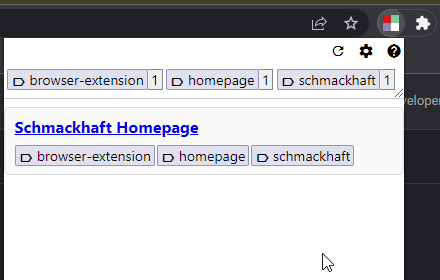

# Schmackhaft

## Early Development

This is an early release for this extension which scratches my own itch.
Development will be slow, unless I notice public interest. In that case I might
shuffle around some priorities to invest more time in this extension.

Feedback is of course more than welcome, epecially in this early stage of the
project.

The biggest shortcoming right now is the visual design and UX of the extension.
As this is, for now, dogfood-ware, this might remain basic as UI/UX design is
not my strength.

## Description

This extension allows the storage of bookmarks in a *non-hierarchical*
structure. Each bookmark is identified by the URL and has a collection of
*tags*. They can then be browsed by filtering according to those tags.

This in turn allows "drilling down" into tags without being forced to pick a specific tag as "first level". So whether you pick "Python" first and _then_ "Programming" is going to be the same as picking "Programming" first followed by "Python".

This reproduces a behaviour reminiscent to to https://del.icio.us from the early
2000s which has since completely changed its behaviour and is - to the best of
my knowledge - become effectively defunct.

## Screenshots

### Browser Button

The Browser Button gives access to the stored bookmarks. It also contains a
refresh button to force a reload. This can be useful if remote JSON URLs have
changed.

Clicking on the tag-chips at the top will add them to the filter. The bottom
panel will then show only bookmarks with those tags. Clicking on an additional
tag, will filter the bookmarks further.

Clicking on a filtered tag will remove it again.



### Preferences/Options

The extension currently has two main options:

* A list of external JSON URLs
* An option to include browser-stored bookmarks in the UI or not.

Each JSON URL can store bookmarks in the format described below. To remove a URL, simply set it to the empty string.

Enabling the browser bookmarks will make them available. They will all have the
automatic tag "browser bookmark" and each folder-name is used as additional
tags.


## Bookmark Collections

The extension aims to provide support for multiple collections from which to
draw un when browsing the bookmarks. This currently (in version 0.3) this only
supports external JSON files and the bookmarks stored in the browser.
Collection support is flexible in the source code and additional collections can
be added fairly easily.

### Web URL (JSON)

The initially supported JSON collection is read-only and only simple HTTP-GET requests are made. An example collection looks like this:

```javascript
[
  {
    "href": "https://www.google.com",
    "tags": ["search", "google"],
    "title": "Google Search",
    "description": "An example description"
  },
  {
    "href": "https://news.ycombinator.com",
    "tags": ["news", "it"],
  },
  {
    "href": "https://duckduckgo.com",
    "tags": ["search"]
  },
  {
    "href": "https://bbc.com",
    "tags": ["news", "world"]
  },
];
```

## Development & Maintenance

1. Clone the Repository

   ```
   git clone https://github.com/exhuma/schmackhaft
   cd schmackhaft
   ```

1. Install all dependencies

   ```
   npm ci
   ```

1. Build the extension

   The project provides a `Makefile` to abstract away browser differences. To
   build, simply run:

   ```
   make
   ```

   This will create the subfolder `dist/chrome` and `dist/mozilla` which should
   cover most browsers.

1. Component Development

   For an easier development cycle, a lot of code is written in
   [lit](https://lit.dev). This allows us to run a development server with `npm
   run serve` and access `/demo/index.html` to try out the components. This
   makes it possible to have a develop/test cycle without the need to reload the
   browser extension. It also makes it a lot easier to use the browser
   development tools.

1. Load the extension into the browser for testing

   Bug/Feature-tracker is over at [exhuma/schmackhaft](https://github.com/exhuma/schmackhaft).

   * [Mozilla: Installing](https://developer.mozilla.org/en-US/docs/Mozilla/Add-ons/WebExtensions/Your_first_WebExtension#installing)
   * [Chrome: Loading unpacked extensions](https://developer.chrome.com/docs/extensions/mv3/getstarted/#unpacked)
